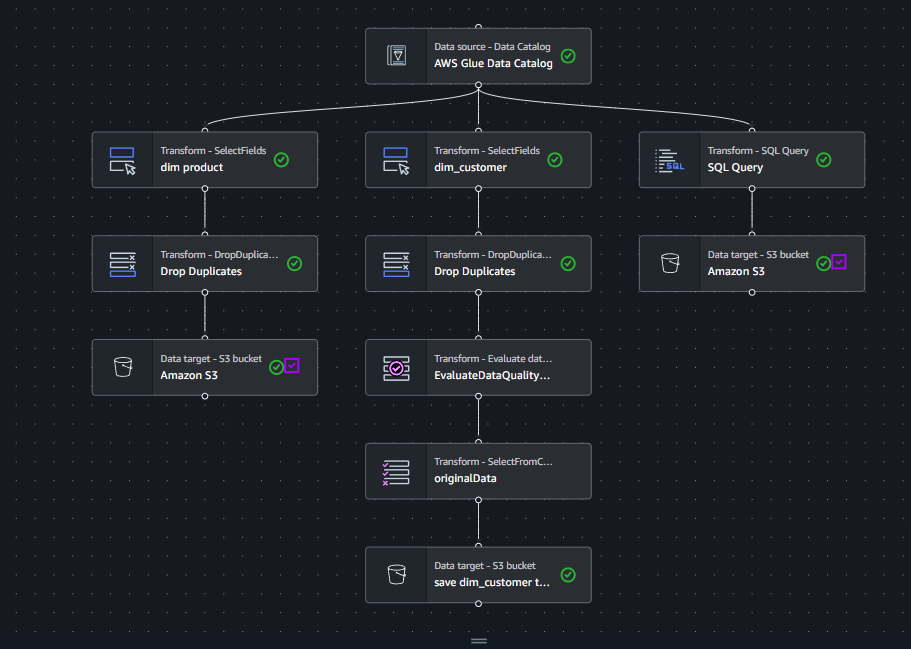

# AWS Glue ETL – Sales Data Normalization
## overview
Project ini membangun pipeline ETL menggunakan AWS Glue (Visual ETL) untuk:
- Mengambil data transaksi penjualan dari Amazon S3
- Membersihkan dan mentransformasi data
- Menormalisasi data menjadi model Star Schema
- Menyimpan hasil dalam format Parquet di S3

## Architecture
```
S3 (raw CSV)
    ↓
Glue Crawler
    ↓
Glue Data Catalog (table: raw)
    ↓
Glue Visual ETL Job
    ├── dim_customer
    ├── dim_product
    └── fact_sales
    ↓
S3 (processed - Parquet)
```

## S3 Structure
```
s3://glue-belajar-irfan/
│
├── raw/
│   └── sales_data.csv
│
└── processed/
    ├── dim_customer/
    ├── dim_product/
    └── fact_sales/
```

## Source Data
file `sales_data.csv`
Kolom:
- order_id
- order_date
- customer_name
- city
- product
- category
- quantity
- price
- Setiap baris merepresentasikan 1 transaksi.

## ETL Process

Pipeline dibuat menggunakan **AWS Glue Visual ETL**.

### 1. Extract

Data dibaca dari S3 melalui AWS Glue Data Catalog:

```
Database : db_irfan_belajar
Table    : raw
Source   : s3://glue-belajar-irfan/raw/
```

---

### 2. Transform

#### 2.1 dim_customer

Transformasi:
- Select kolom: `customer_name`, `city`
- Drop duplicate berdasarkan `customer_name`, `city`

Output:

```
s3://glue-belajar-irfan/processed/dim_customer/
Format: Parquet (Snappy)
```

---

#### 2.2 dim_product

Transformasi:
- Select kolom: `product`, `category`
- Drop duplicate berdasarkan `product`, `category`

Output:

```
s3://glue-belajar-irfan/processed/dim_product/
Format: Parquet (Snappy)
```

---

#### 2.3 fact_sales

Transformasi:
- Mengambil seluruh kolom transaksi
- Menambahkan kolom baru:

```
total_amount = quantity * price
```

## ETL Workflow



Output:

```
s3://glue-belajar-irfan/processed/fact_sales/
Format: Parquet (Snappy)
```

---

## Data Model (Star Schema)

```
               dim_customer
                   |
                   |
dim_product ---- fact_sales
```

- `fact_sales` = tabel transaksi
- `dim_customer` = referensi customer
- `dim_product` = referensi produk

---

## Technology Used

- AWS S3
- AWS Glue
- Spark (Glue Engine)
- Parquet 
