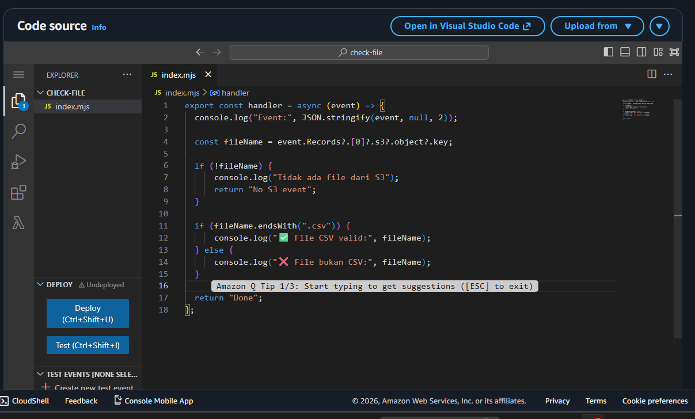
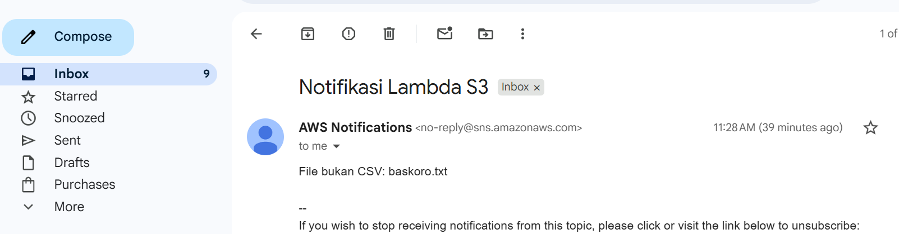
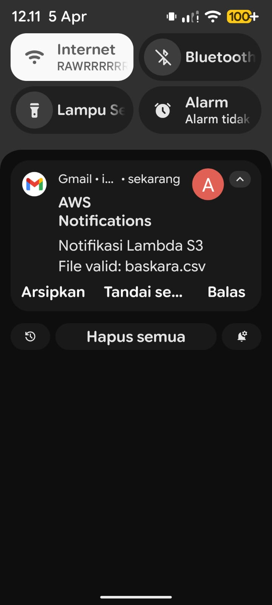

# AWS Lambda – S3 File Validation & Email Notification

## Overview
Project ini membangun pipeline event-driven serverless di AWS untuk:

- Mendeteksi file yang diupload ke Amazon S3
- Memvalidasi apakah file berformat `.csv`
- Mengirim notifikasi otomatis melalui email menggunakan SNS
- Monitoring proses menggunakan CloudWatch

---

## Architecture

```
S3 (File Upload)
    ↓
Lambda (File Validation)
    ↓
SNS Topic
    ↓
Email Subscription
```

---

## S3 Structure

```
s3://lambda-demo-irfan-123/
│
└── (uploaded files)
    ├── data.csv
    ├── image.png
    └── dll
```

---

## Event Flow

1. User upload file ke S3  
2. S3 trigger Lambda function  
3. Lambda membaca nama file  
4. Lambda melakukan validasi:
   - `.csv` → valid  
   - selain `.csv` → invalid  
5. Lambda publish message ke SNS  
6. SNS mengirim email ke subscriber  

---

## Lambda Logic

### Input Event

```
event.Records[0].s3.object.key
```

### Validation Logic

- Jika file berakhiran `.csv` → valid  
- Jika tidak → invalid  

### Output

Lambda mengirim message ke SNS:

- Subject: `S3 File Notification`  
- Message:
  - Valid → File CSV valid  
  - Invalid → File bukan CSV  

---

## Lambda Code

```javascript
import { SNSClient, PublishCommand } from "@aws-sdk/client-sns";

const sns = new SNSClient({ region: "us-east-1" });

export const handler = async (event) => {
    const fileName = event.Records?.[0]?.s3?.object?.key;

    if (!fileName) return;

    let message;

    if (fileName.endsWith(".csv")) {
        message = `File CSV valid: ${fileName}`;
    } else {
        message = `File bukan CSV: ${fileName}`;
    }

    await sns.send(new PublishCommand({
        TopicArn: "YOUR_TOPIC_ARN",
        Message: message,
        Subject: "S3 File Notification"
    }));

    return "Done";
};
```

---


## IAM Configuration

Lambda membutuhkan permission untuk publish ke SNS.

```
AmazonSNSFullAccess
```

---

## Monitoring

Menggunakan AWS CloudWatch:

```
/aws/lambda/check-file
```

Digunakan untuk:
- Debug error  
- Melihat log event  
- Validasi output Lambda  

---

## Testing

### Test Case

| File        | Result        |
|-------------|--------------|
| data.csv    | Email valid   |
| image.png   | Email invalid |
| file.txt    | Email invalid |





---

## Technology Used

- AWS Lambda  
- Amazon S3  
- Amazon SNS  
- AWS CloudWatch  
- AWS IAM  

---


## Author

Irfan
