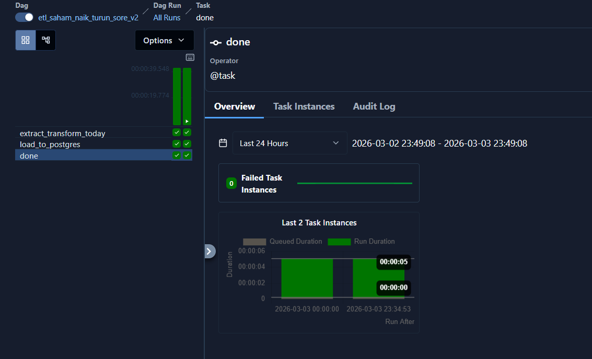
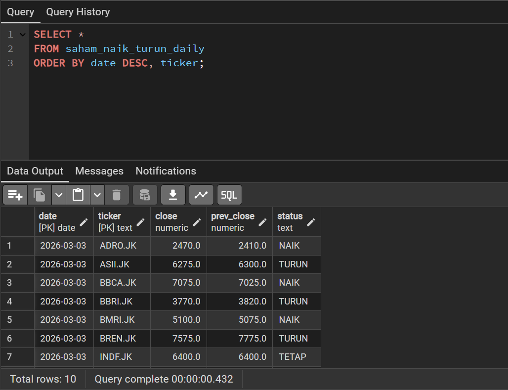

#  Airflow ETL – IDX Stock Daily Up/Down Pipeline

Mini Data Engineering project menggunakan Apache Airflow (Astro CLI) untuk melakukan ETL data saham Indonesia (IDX) secara terjadwal dan menyimpan hasilnya ke PostgreSQL.


---

#  Project Overview

Pipeline ini melakukan:

1. Extract  
   Mengambil data harga penutupan (Close) 10 saham Indonesia dari yfinance.

2. Transform  
   Membandingkan harga Close hari ini dengan hari sebelumnya:
   - NAIK  → jika close > prev_close  
   - TURUN → jika close < prev_close  
   - TETAP → jika sama  

3. Load  
   Menyimpan hasil ke PostgreSQL lokal (Docker container Astro).

4. Schedule  
   Berjalan otomatis setiap hari kerja:

   0 17 * * 1-5

   (17:00 UTC / 00:00 WIB)

---

#  Architecture

yfinance API  
        ↓  
Airflow DAG (Astro)  
        ↓  
Transform Logic (Pandas)  
        ↓  
PostgreSQL (Docker)  
        ↓  
Viewed via pgAdmin  

---

#  Project Structure
```
airflow-project/
│
├── dags/
│   └── etl_saham_naik_turun_simple.py
│
├── requirements.txt
├── Dockerfile
└── README.md
```
---

#  Database Schema

Table: saham_naik_turun_daily
```
| Column      | Type     | Description |
|------------|----------|------------|
| date       | DATE     | Tanggal trading |
| ticker     | TEXT     | Kode saham (e.g., BBCA.JK) |
| close      | NUMERIC  | Harga penutupan hari ini |
| prev_close | NUMERIC  | Harga penutupan hari sebelumnya |
| status     | TEXT     | NAIK / TURUN / TETAP |
```
Primary Key:
(date, ticker)

---

#  Example Query – Lihat Data

```sql
SELECT *
FROM saham_naik_turun_daily
ORDER BY date DESC, ticker;
```

---

#  Summary Harian (Jumlah Naik vs Turun)

```sql
SELECT
    date,
    SUM(CASE WHEN status = 'NAIK' THEN 1 ELSE 0 END) AS naik,
    SUM(CASE WHEN status = 'TURUN' THEN 1 ELSE 0 END) AS turun,
    SUM(CASE WHEN status = 'TETAP' THEN 1 ELSE 0 END) AS tetap
FROM saham_naik_turun_daily
GROUP BY date
ORDER BY date DESC;
```

---

# How To Run

##  Start Astro

```bash
astro dev start
```

##  Open Airflow UI

http://localhost:8080

##  Activate DAG

Enable DAG:
etl_saham_naik_turun_sore_v2


##  View Data via pgAdmin

Connection Settings:

Host: localhost  
Port: 5433  
Database: postgres  
Username: postgres  
Password: postgres  

Navigate to:

Servers  
 → Astro Local  
   → Databases  
     → postgres  
       → Schemas  
         → public  
           → Tables  
             → saham_naik_turun_daily  

Right click → View/Edit Data → All Rows

---

#  Tech Stack

- Apache Airflow (Astro CLI)
- Python
- Pandas
- yfinance
- PostgreSQL
- Docker
- pgAdmin

---

#  Learning Outcomes

Project ini mencakup:

- ETL pipeline design
- Task orchestration dengan Airflow
- Scheduling dengan cron
- PostgreSQL integration
- Docker container networking
- Data upsert logic (ON CONFLICT)
- Data validation sederhana (NAIK/TURUN/TETAP)


# 💡 Author

Praktek Projek Mini
Apache Airflow + PostgreSQL + Docker
