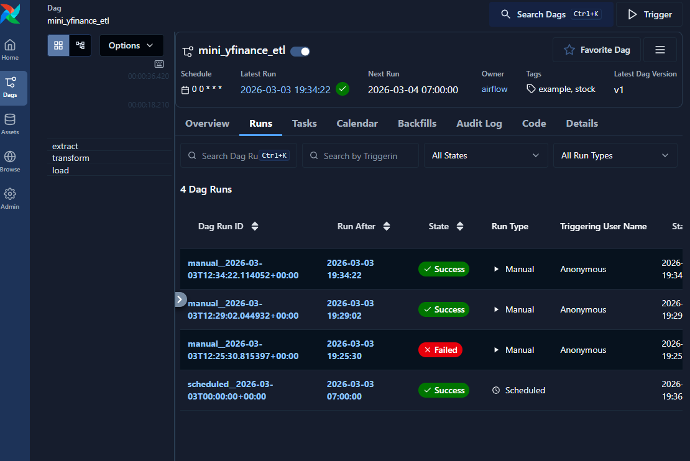

# 📊 Mini YFinance ETL with Apache Airflow (Astro)

## 📌 Overview
Project ini adalah mini ETL pipeline menggunakan Apache Airflow (Astro CLI).  
Workflow ini mengambil data saham dari Yahoo Finance, menghitung return harian, lalu menyimpan hasilnya sebagai file CSV.  
Tujuan project ini adalah memahami dasar orchestration, scheduling, dan monitoring workflow data.

---

## 🔄 Workflow

### 1️⃣ Extract
Mengambil data saham AAPL (5 hari terakhir) menggunakan library `yfinance`.

### 2️⃣ Transform
- Membersihkan kolom `Close`
- Menghitung **daily return (%)**
- Menghitung rata-rata harga penutupan

Catatan:  
Baris pertama `daily_return_%` bernilai `NaN` karena tidak ada data hari sebelumnya untuk perhitungan.

### 3️⃣ Load
Menyimpan hasil transformasi ke file CSV dan menampilkan preview di log Airflow.

---

## 🛠 Tech Stack
- Apache Airflow 3 (Astro Runtime)
- Python
- Pandas
- yfinance
- Docker

---

## ▶️ Cara Menjalankan

### Start Airflow
```bash
astro dev start
```

### Buka Airflow UI
```
http://localhost:8080
```

Enable DAG → Trigger → Monitor via Runs & Logs.

---

## 📚 Konsep yang Dipelajari

### DAG (Directed Acyclic Graph)
Workflow terjadwal yang mengatur urutan eksekusi task.

### Task Dependency
Menggunakan operator `>>` untuk menentukan urutan:
Extract → Transform → Load.

### Scheduling
DAG dijalankan otomatis dengan schedule `@daily`.

## 📸 Airflow UI Screenshot



### Logging & Monitoring
Airflow UI digunakan untuk:
- Melihat status task
- Debug error
- Melihat output log

---

## 🎯 Tujuan Project
Project ini dibuat sebagai latihan dasar Data Engineering untuk memahami:
- Orchestration workflow
- ETL process
- Containerized environment dengan Docker
- Monitoring pipeline menggunakan Airflow
