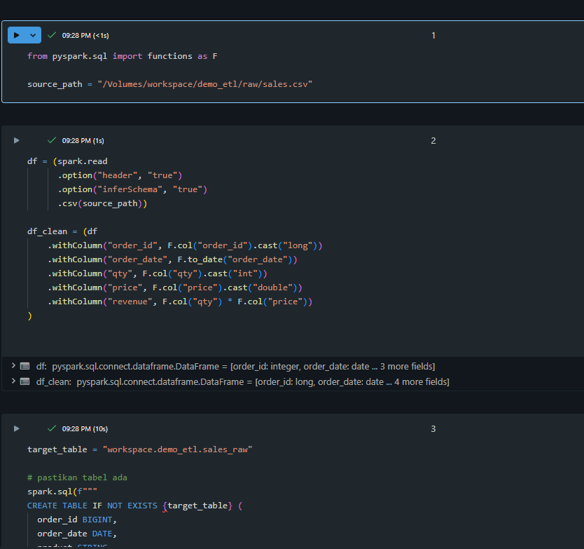
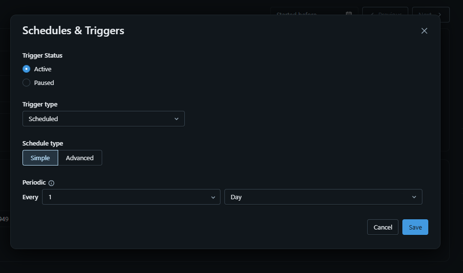
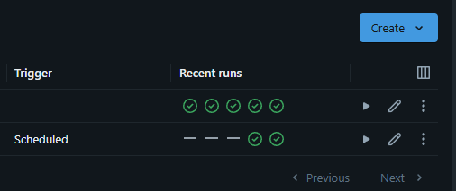
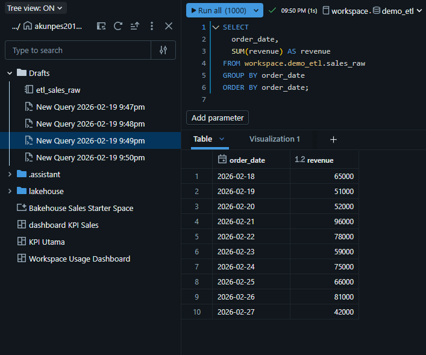
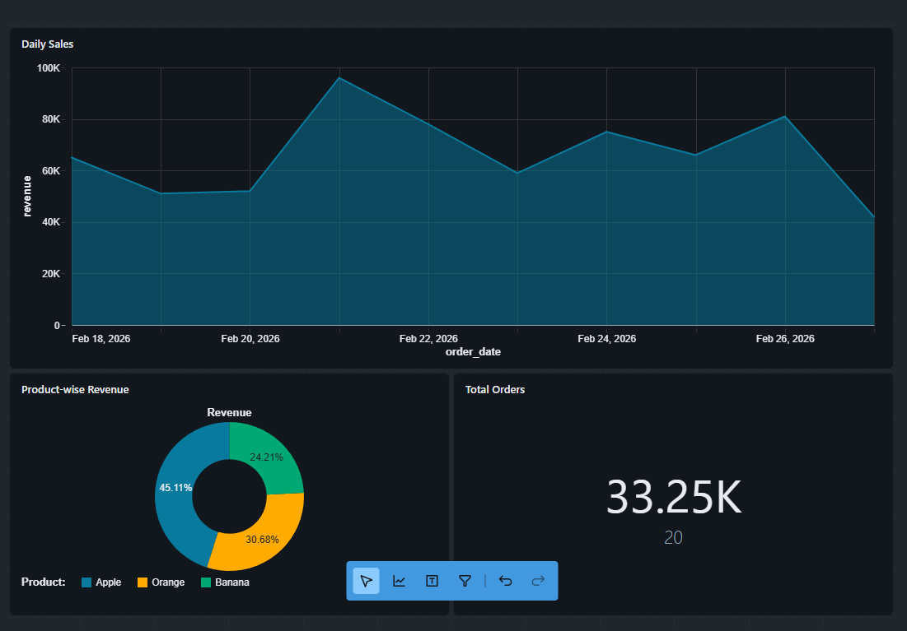

# 📊 End-to-End Sales ETL automation scheduler & BI Project (Databricks Lakehouse)

## 📌 Project Overview

Project ini merupakan implementasi end-to-end data pipeline menggunakan Databricks Lakehouse, dimulai dari ingestion file CSV mentah hingga penyajian dashboard KPI untuk kebutuhan Business Intelligence (BI). Tujuan utama project ini adalah membangun pipeline otomatis yang mampu membaca data penjualan (sales), melakukan transformasi, menyimpannya dalam format Delta Table, serta menyajikan visualisasi yang dapat diperbarui secara berkala melalui scheduler.

Project ini mencerminkan workflow Data Engineer modern: ingestion → transformation → storage → orchestration → visualization.

---

## 🗂 1. Data Ingestion (Raw Layer)

Data sumber berupa file `sales.csv` diupload ke Unity Catalog Volume pada path berikut:

```
/Volumes/workspace/demo_etl/raw/sales.csv
```

Volume berfungsi sebagai lokasi penyimpanan file mentah (raw file) sebelum diproses lebih lanjut. File ini dapat di-overwrite ketika ada data terbaru.

---

## ⚙️ 2. ETL Process (Transformation Layer)

Notebook ETL dibuat untuk membaca file CSV, melakukan type casting, serta menghitung kolom revenue.

### 🔹 PySpark ETL Code

```python
from pyspark.sql import functions as F

source_path = "/Volumes/workspace/demo_etl/raw/sales.csv"

df = (spark.read
      .option("header", "true")
      .option("inferSchema", "true")
      .csv(source_path))

df_clean = (df
    .withColumn("order_id", F.col("order_id").cast("long"))
    .withColumn("order_date", F.to_date("order_date"))
    .withColumn("qty", F.col("qty").cast("int"))
    .withColumn("price", F.col("price").cast("double"))
    .withColumn("revenue", F.col("qty") * F.col("price"))
)

df_clean.write.mode("overwrite").saveAsTable("workspace.demo_etl.sales_raw")

display(spark.table("workspace.demo_etl.sales_raw"))
```
kode 


Notebook ini membaca file mentah, membersihkan tipe data, menghitung revenue, dan menyimpannya ke dalam Delta Table:

```
workspace.demo_etl.sales_raw
```

---

## ⏱ 3. Job Orchestration (Automation)

Notebook ETL kemudian dijalankan melalui Databricks Jobs dengan konfigurasi:

- Task Type: Notebook
- Compute: Serverless
- Schedule: Scheduled
- Interval: 1 Hour (atau custom untuk testing)

Dengan scheduler aktif, pipeline akan berjalan otomatis dan memperbarui tabel setiap interval yang ditentukan.

---
gambar 1 buat scheduler


gambar 2 scheduller sukses


## 📈 4. BI Query Layer

Setelah data tersedia dalam Delta Table, query SQL dibuat untuk kebutuhan reporting dan dashboard.

### 🔹 Daily Revenue Trend

```sql
SELECT
  order_date,
  SUM(revenue) AS revenue
FROM workspace.demo_etl.sales_raw
GROUP BY order_date
ORDER BY order_date;
```

### 🔹 Revenue per Product

```sql
SELECT
  product,
  SUM(revenue) AS revenue
FROM workspace.demo_etl.sales_raw
GROUP BY product
ORDER BY revenue DESC;
```

### 🔹 KPI Summary

```sql
SELECT
  COUNT(DISTINCT order_id) AS total_orders,
  SUM(qty) AS total_qty,
  SUM(revenue) AS total_revenue,
  AVG(revenue) AS avg_order_value
FROM workspace.demo_etl.sales_raw;
```

---
kueri :


## 📊 5. Dashboard Creation

Dashboard dibuat menggunakan Databricks Lakeview Dashboard.

Langkah yang dilakukan:

1. Query ditambahkan ke Dashboard melalui SQL Editor.
2. Multiple query dimasukkan dalam 1 page dashboard.
3. Visualisasi yang digunakan:
   - Line Chart → Daily Revenue
   - Bar Chart → Revenue per Product
   - KPI Card → Total Revenue & Orders
4. Layout dashboard diatur ulang (drag & resize) agar rapi.
5. Dashboard dipublish agar siap digunakan.

Dashboard akan menampilkan data terbaru setiap kali:
- Job ETL berjalan
- Dashboard di-refresh
- Dashboard dibuka ulang

---

output dashboard

## 🔄 6. Incremental Simulation

Untuk simulasi data baru:
- File `sales.csv` di-overwrite dengan data terbaru.
- Job dijalankan (manual atau scheduled).
- Data pada Delta Table bertambah.
- Dashboard otomatis merefleksikan perubahan setelah refresh.

---

## 🏗 Final Architecture Flow

```
Raw CSV (Unity Volume)
        ↓
PySpark ETL Notebook
        ↓
 Table (sales_raw)
        ↓
Databricks Job (Scheduler)
        ↓
SQL Query Layer
        ↓
Lakeview Dashboard
```

---

## 🎯 Conclusion

- Unity Catalog Volume untuk raw data storage
- PySpark untuk transformation
- Delta Table untuk storage layer
- Databricks Jobs untuk automation
- SQL Editor untuk query layer
- Lakeview Dashboard untuk visualization

---
