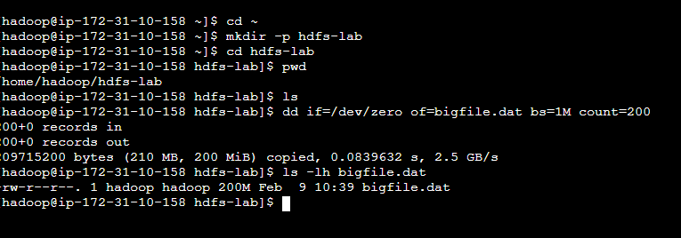
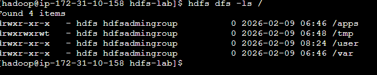
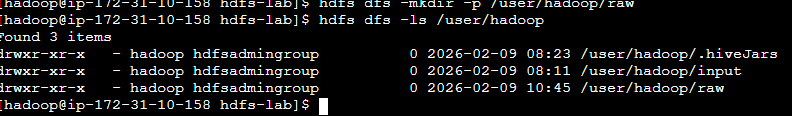
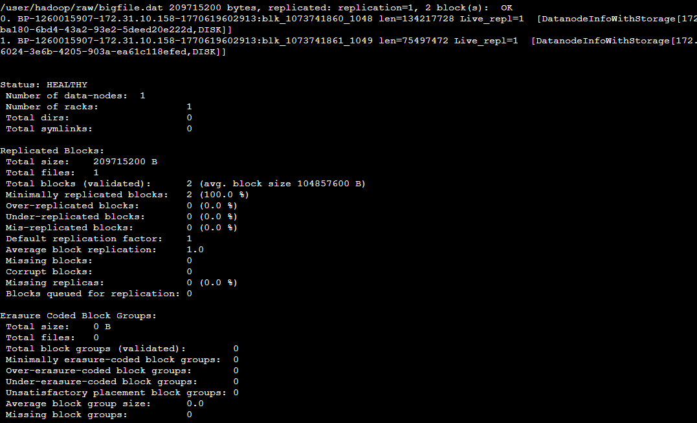
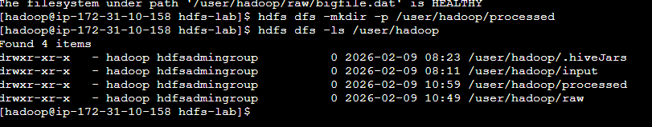
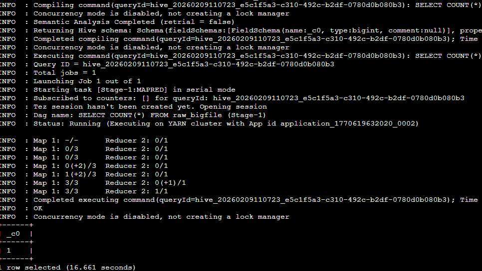
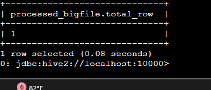
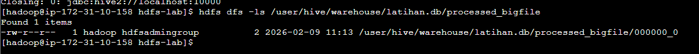

# Hadoop HDFS & Hive – Mini Data Pipeline (AWS EMR)

## Gambaran Umum Alur Data
```
Linux FS (EC2)
   │
   │  (file besar / banyak data)
   ▼
HDFS - RAW ZONE  
(/user/hadoop/raw)
   │
   │  (block, replication, metadata)
   ▼
Hive / MapReduce Job
   │
   │  (distributed processing via YARN)
   ▼
HDFS - PROCESSED ZONE  
(/user/hadoop/processed)
```
---

## Step 1 – Persiapan Linux Environment

Masuk ke hadoop  
Lalu buat folder lab di linux dan masuk kesana

```bash
cd ~
mkdir -p hdfs-lab
cd hdfs-lab
pwd
```

---

## Step 2 – Membuat File Besar (Simulasi Data)

Buat file besar untuk simulasi

```bash
dd if=/dev/zero of=bigfile.dat bs=1M count=200
```

Lalu cek ukuranya

```bash
ls -lh bigfile.dat
```

Output  



---

## Step 3 – Cek HDFS & Siapkan Folder RAW

Pastikan hdfs bisa diakses  
Siapkan raw zone ( tempat data mentah )

```bash
hdfs dfs -ls /
```

Output  



Cek home directory di HDFS

```bash
hdfs dfs -ls /user
```

Kalau belum ada folder raw itu normal

Selanjutnya buat RAW zone di HDFS

```bash
hdfs dfs -mkdir -p /user/hadoop/raw
```

Cek

```bash
hdfs dfs -ls /user/hadoop
```

Output  



---

## Step 4 – Masukkan File 200MB ke HDFS (RAW Zone)

Pastikan masih di folder hdfs-lab  
Lalu

```bash
hdfs dfs -put bigfile.dat /user/hadoop/raw/
```

Tunggu sampai selesai

Cek file di HDFS

```bash
hdfs dfs -ls /user/hadoop/raw
```

Yang harus kelihatan  
bigfile.dat → ukuran 200MB

---

## Step 5 – Melihat “Jeroan” HDFS (Block & DataNode)

Tujuan step ini:
- Melihat file HDFS dipecah jadi block
- Melihat block itu disimpan di node mana

Jalankan

```bash
hdfs fsck /user/hadoop/raw/bigfile.dat -files -blocks -locations
```
output
Ringkasan paling atas adalah kuncinya

```
/user/hadoop/raw/bigfile.dat 209715200 bytes, replicated: replication=1, 2 block(s): OK
```

Ukuran file: 209,715,200 bytes ≈ 200 MB  
Replication factor: 1  
Jumlah block: 2  
Status: OK (sehat)

File 200MB dipecah jadi 2 block, bukan 1 file utuh

Block pertama

```
blk_1073741860_1048
len=134217728
Live_repl=1
```
Artinya:
•	Block ID: blk_1073741860_1048
•	Ukuran block: 134,217,728 bytes = 128 MB
•	Replication aktif: 1
 Ini block pertama, ukurannya FULL sesuai block size default HDFS.

Block kedua

```
blk_1073741861_1049
len=75497472
Live_repl=1
```
Artinya:
•	Block ID: blk_1073741861_1049
•	Ukuran block: ~72 MB
•	Replication: 1

Block terakhir tidak harus penuh, 200 – 128 = 72




---

## Step 6 – PROCESSED Zone di HDFS

Tujuan step ini:
- Bikin alur raw → processed
- Raw itu data asli tidak diubah, processing selalu bikin output baru

```bash
hdfs dfs -mkdir -p /user/hadoop/processed
```

Cek

```bash
hdfs dfs -ls /user/hadoop
```
output



---

## Step 7 – Masuk Hive (Beeline)
Tujuan step ini:
•	Masuk ke engine yang akan memproses data di HDFS
•	BELUM bikin table, BELUM query

```bash
beeline
```

```bash
!connect jdbc:hive2://localhost:10000
```

User: hadoop  
Password: kosong (enter)

---

## Step 8 – Pilih Database

```sql
CREATE DATABASE latihan;
```

```sql
USE latihan;
```

---

## Step 9 – Bikin Table RAW dari File HDFS
Tujuan step ini:
•	Menghubungkan file di HDFS (raw) ke Hive
•	Tanpa memindahkan data

```sql
CREATE EXTERNAL TABLE raw_bigfile (
  line STRING
)
ROW FORMAT DELIMITED
FIELDS TERMINATED BY '\n'
LOCATION '/user/hadoop/raw';
```

Cek isinya

```sql
SELECT COUNT(*) FROM raw_bigfile;
```
Yang terjadi:
•	Hive compile query
•	Submit job ke YARN
•	YARN allocate resource
•	Map task baca block HDFS
•	Reduce hitung hasil
Ini inti Hadoop ecosystem kerja bareng

Kenapa hasilnya = 1
•	File dummy kamu tidak punya newline
•	Hive menganggapnya 1 baris
•	Jadi COUNT(*) = 1
ini nunjukin:
Hadoop peduli struktur data, bukan ukuran file




---

## Step 10 – Tulis Hasil Processing ke HDFS ( PROCESSED zone )

Tujuan step ini:
•	Melihat output job Hadoop
•	Melengkapi alur raw → processed

Masih di Hive (database latihan),

```sql
CREATE TABLE processed_bigfile
STORED AS TEXTFILE
AS
SELECT COUNT(*) AS total_row
FROM raw_bigfile;
```
Cek hasilnya di hive
```sql
SELECT * FROM processed_bigfile;
```




---

## Step 11 – Lihat Output PROCESSED di HDFS
cek lokasi data table processed_bigfile
```sql
DESCRIBE FORMATTED processed_bigfile;
```

cari baris location 

``` Location:                     | hdfs://ip-172-31-10-158.ec2.internal:8020/user/hive/warehouse/latihan.db/processed_bigfile | ```

setelah itu quit, lalu lihat isi folder hdfs
```bash
hdfs dfs -ls /user/hive/warehouse/latihan.db/processed_bigfile
```

Hasilnya adalah 1,
Karena kita menyimpan hasil kueri dari kueri count yang dijalankan diatas
 ini adalah hasil akhir pipeline



