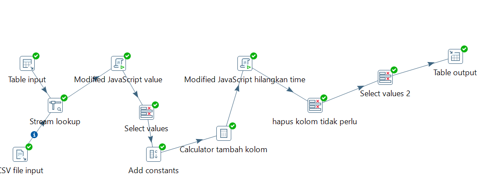
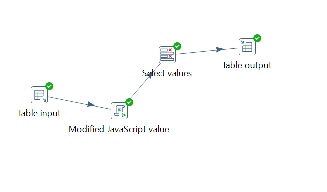
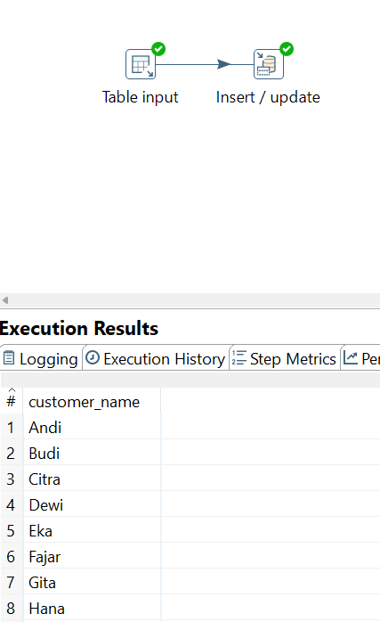
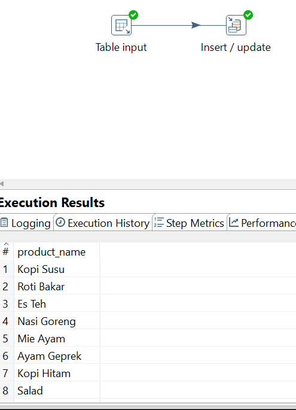
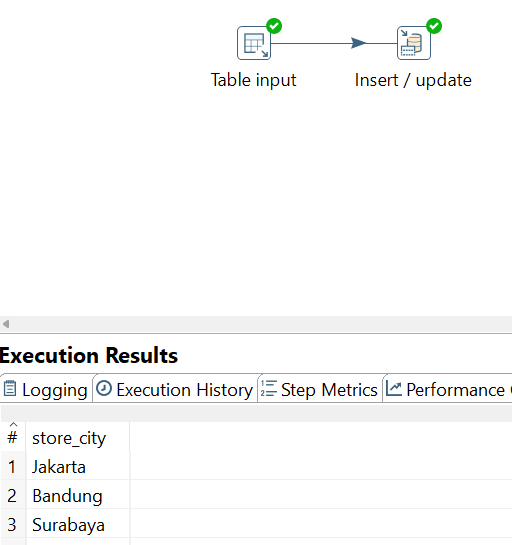
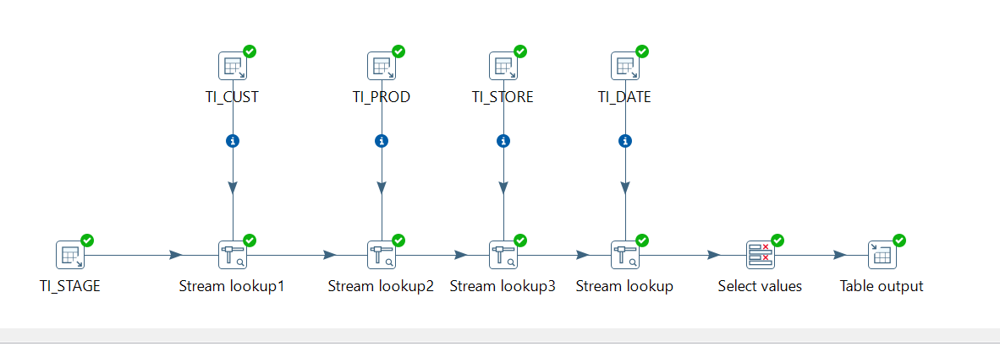
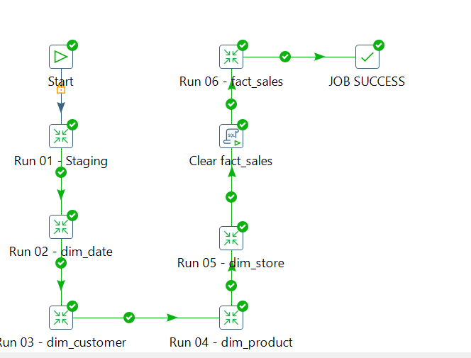
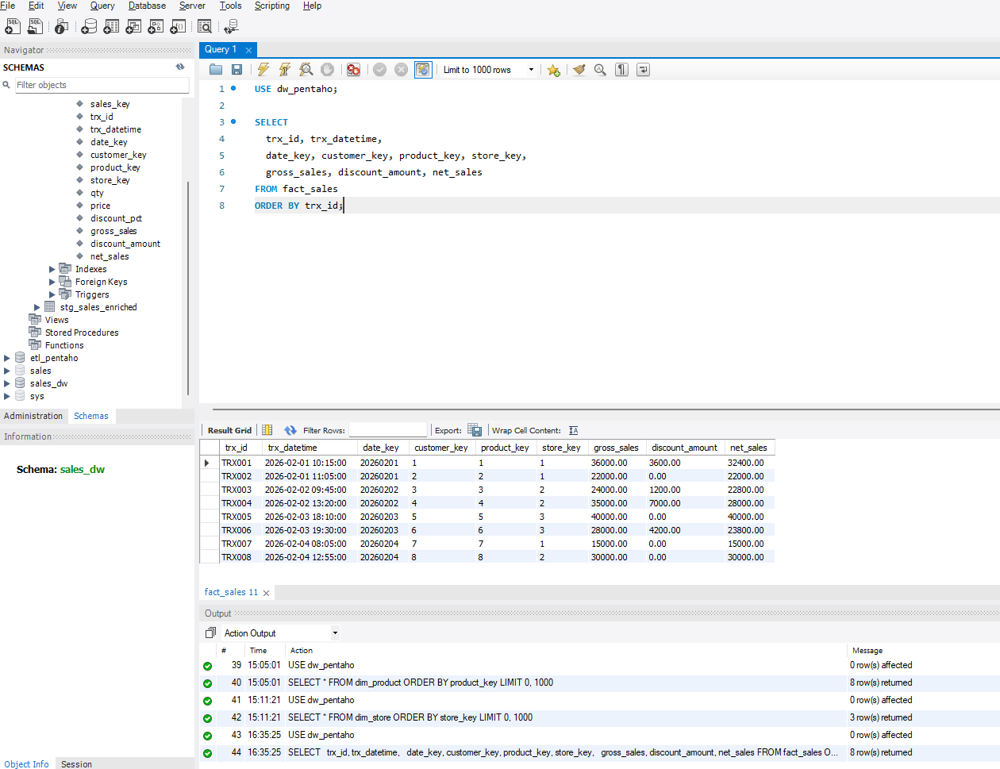

#  Data Warehouse Project – Pentaho PDI (MySQL)

##  Overview

Project ini merupakan implementasi **Mini Data Warehouse** menggunakan **Pentaho Data Integration (PDI / Spoon)** dengan database **MySQL**.

Pipeline ini membangun arsitektur **Star Schema** yang terdiri dari:

- Staging Layer
- Dimension Tables
- Fact Table
- Surrogate Key Lookup
- ETL Orchestration (Job)

Project ini mensimulasikan sistem transaksi retail (POS) yang diproses menjadi model analitik siap BI.

---

#  Arsitektur Data Warehouse

##  Layer 1 – Staging

### Source Data:
- MySQL (`pos_sales`)
- CSV (`promo_adjustments`)

Diproses menjadi tabel staging:

```
stg_sales_enriched
```

### Kolom:
- trx_id
- trx_datetime
- trx_date
- customer_name
- product_name
- store_city
- qty
- price
- discount_pct
- gross_sales
- discount_amount
- net_sales

---

##  Layer 2 – Dimension Tables

### 🗓 dim_date
| Column |
|--------|
| date_key (PK) |
| full_date |
| day |
| month |
| month_name |
| quarter |
| year |

---

###  dim_customer
| Column |
|--------|
| customer_key (PK) |
| customer_name |

---

###  dim_product
| Column |
|--------|
| product_key (PK) |
| product_name |

---

###  dim_store
| Column |
|--------|
| store_key (PK) |
| store_city |

---

##  Layer 3 – Fact Table

###  fact_sales

| Column |
|--------|
| sales_key (PK) |
| trx_id (Unique) |
| trx_datetime |
| date_key (FK) |
| customer_key (FK) |
| product_key (FK) |
| store_key (FK) |
| qty |
| price |
| discount_pct |
| gross_sales |
| discount_amount |
| net_sales |

Fact table menggunakan **surrogate key dari dimension table** untuk optimasi join dan performa query analitik.

---

#  ETL Flow (Transformation Level)

## 01 – Staging Transformation
- Read MySQL transaction data
- Read CSV promo data
- Stream Lookup join berdasarkan trx_id
- Hitung gross_sales
- Hitung discount_amount
- Hitung net_sales
- Generate trx_date
- Load ke `stg_sales_enriched`



---

## 02 – Build dim_date
- Ambil DISTINCT trx_date
- Generate date_key (YYYYMMDD)
- Generate atribut waktu (day, month, quarter, year)
- Insert / Update ke dim_date (Upsert)



---

## 03 – Build dim_customer
- SELECT DISTINCT customer_name
- Insert / Update ke dim_customer



---

## 04 – Build dim_product
- SELECT DISTINCT product_name
- Insert / Update ke dim_product



---

## 05 – Build dim_store
- SELECT DISTINCT store_city
- Insert / Update ke dim_store



---

## 06 – Build fact_sales
- Ambil data dari staging
- Stream Lookup ke:
  - dim_customer
  - dim_product
  - dim_store
  - dim_date
- Retrieve surrogate keys
- Clear fact_sales (pre-load step)
- Load ke fact_sales



---

#  Job Orchestration (Orkestrasi ETL)

Semua transformation dijalankan melalui 1 Job:

```
job_dw_pos_orchestrator.kjb
```

### Urutan Eksekusi:

Start  
→ Run 01 - Staging  
→ Run 02 - dim_date  
→ Run 03 - dim_customer  
→ Run 04 - dim_product  
→ Run 05 - dim_store  
→ Clear fact_sales  
→ Run 06 - fact_sales  
→ JOB SUCCESS  

Job ini bertugas untuk:
- Mengatur urutan eksekusi
- Menangani dependency antar layer
- Menghindari duplicate data
- Memastikan seluruh pipeline berjalan end-to-end dengan 1 klik

---

#  Star Schema Diagram (Conceptual)

```
         dim_customer
               |
         dim_product
               |
dim_date ---- fact_sales ---- dim_store
```

Fact table berada di tengah dan terhubung ke semua dimension table menggunakan foreign key.

---

#  Key Concepts Implemented

##  ETL vs ELT
Project ini menggunakan pendekatan ETL klasik dengan Pentaho PDI.

##  Surrogate Key
Semua dimension menggunakan integer surrogate key sebagai primary key.

##  Insert / Update (Upsert)
Dimension table menggunakan mekanisme upsert untuk mencegah duplicate.

##  Stream Lookup
Digunakan untuk mengganti natural key menjadi surrogate key.

##  Star Schema Design
Optimized untuk analytical query & BI reporting.

##  Layered Architecture
Source → Staging → Dimension → Fact



---

#  Scheduling (Production Simulation)

Job dapat dijalankan melalui command line menggunakan Kitchen:

```bash
kitchen.bat /file:"path\to\job_dw_pos_orchestrator.kjb"
```

Scheduling dapat dilakukan menggunakan:
- Windows Task Scheduler
- Cron (Linux)
- Jenkins / Airflow (Enterprise Environment)
- Pentaho Server (Enterprise Edition)

---

#  Tools & Technology

- Pentaho Data Integration (Spoon)
- MySQL
- CSV File Input
- Stream Lookup
- Insert / Update
- Kitchen (Command Line Runner)
- Windows Task Scheduler (optional)

---

#  Project Status

 Staging Loaded  
 Dimensions Loaded (Upsert Enabled)  
 Fact Table Loaded  
 Surrogate Key Lookup Working  
 Job Orchestration Implemented  
 Ready for Scheduling  

Project berhasil membangun mini Data Warehouse end-to-end menggunakan Pentaho PDI dengan orkestrasi job.

---

# 👨‍💻 Author

Built as hands-on ETL & Data Warehouse practice project using Pentaho PDI.
