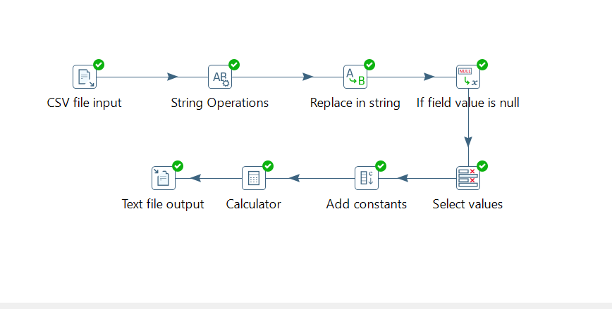

#  Pentaho PDI ETL – CSV Sales Processing

Project ini merupakan latihan ETL menggunakan **Pentaho Data Integration (Spoon)** dengan sumber data berupa **file CSV (tanpa database)**.

Tujuan dari project ini:

- Membersihkan data mentah (data cleansing)
- Mengubah tipe data dengan benar (data conversion)
- Menghitung metrik penjualan
- Mengekspor hasil transformasi ke file CSV baru

---

#  Dataset

File input:

`sales_raw_data.csv`

## Struktur Kolom

- `trx_id`
- `trx_date`
- `customer_name`
- `product_name`
- `qty`
- `price`
- `discount_pct`

---

#  Alur Transformasi (ETL Flow)

Berikut urutan transformasi yang dibuat di Spoon:

```
CSV File Input
    ↓
String Operations (Trim)
    ↓
Replace in String (Handle Empty Value)
    ↓
If Field Value is Null
    ↓
Select Values (Convert Data Type)
    ↓
Add Constants
    ↓
Calculator
    ↓
Text File Output
```

---

#  Step 1 – CSV File Input

Semua field dibaca sebagai:

```
Type = String
```

### Kenapa dibaca sebagai String?

Karena file CSV secara default adalah teks.  
Best practice ETL adalah:

> Clean as string first → Convert later

Hal ini mencegah error parsing saat data masih kotor.

---

#  Step 2 – String Operations

Digunakan untuk menghapus spasi di kiri dan kanan field.

### Setting:

```
Trim type = both
```

### Field yang di-trim:

- `customer_name`
- `product_name`
- `qty`
- `price`
- `discount_pct`

---

#  Step 3 – Replace in String

Digunakan untuk mengubah nilai kosong menjadi `0`.

### Setting:

```
Field     : discount_pct
Use RegEx : ✓
Search    : ^\s*$
Replace   : 0
```

### Artinya:

Jika field kosong atau hanya berisi spasi → ganti menjadi `0`.

---

#  Step 4 – If Field Value is Null

Digunakan untuk memastikan nilai `NULL` juga menjadi `0`.

### Setting:

```
Field              : discount_pct
Replace by value   : 0
```

---

#  Step 5 – Select Values (Convert Data Type)

Setelah data bersih, lakukan konversi tipe data.

### Setting Meta-data:

```
qty           → Integer
price         → Number
discount_pct  → Number
trx_date      → Date
Format        → yyyy-MM-dd HH:mm:ss
```

---

#  Step 6 – Add Constants

Menambahkan konstanta untuk keperluan perhitungan persentase.

```
Name  : const_100
Type  : Number
Value : 100
```

---

#  Step 7 – Calculator

Perhitungan yang dilakukan:

```
gross_sales     = qty * price
discount_rate   = discount_pct / const_100
discount_value  = gross_sales * discount_rate
net_sales       = gross_sales - discount_value
```

### Setting penting:

```
Value type = Number
Precision  = 0  (untuk gross_sales, discount_value, net_sales)
Precision  = 2  (untuk discount_rate)
```

> Catatan: Preview Spoon mungkin tetap menampilkan `.0`, tetapi itu hanya tampilan internal Double.

---

#  Step 8 – Text File Output

### Setting utama:

```
Filename  : C:\sales_output
Extension : csv
Separator : ,
Header    : ✓
```

Output file yang dihasilkan:

`sales_output.csv`

---

#  Hasil Transformasi

Field tambahan yang dihasilkan:

- `gross_sales`
- `discount_rate`
- `discount_value`
- `net_sales`

Contoh hasil:

```
gross_sales    : 168000
discount_value : 0
net_sales      : 168000
```


output 

---

# 🛠 Tools

- Pentaho Data Integration (Spoon)
- CSV Dataset
