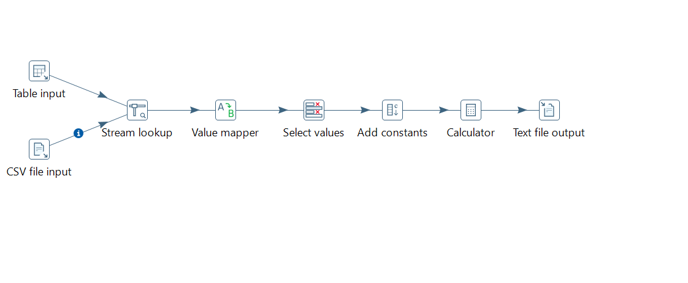

# Pentaho PDI — ETL Merge Data (SQL + CSV Promo) → CSV Output

Project ini adalah latihan **ETL (Extract–Transform–Load)** menggunakan **Pentaho Data Integration (Spoon)** untuk memproses data transaksi dari **database MySQL (POS/offline)**, lalu melakukan **lookup diskon promo dari file CSV**, menghitung metrik penjualan, dan mengekspor hasilnya ke **file CSV final**.

Project ini berfokus pada integrasi multi-source sederhana (SQL + CSV), data cleansing ringan, lookup/join, serta perhitungan metrik penjualan.

---

## Fitur Utama

- Membaca data transaksi dari MySQL (Table Input)
- Membaca data promo dari CSV (CSV File Input)
- Melakukan lookup diskon berdasarkan `trx_id` (Stream Lookup)
- Menangani nilai kosong pada diskon menggunakan Value Mapper
- Konversi tipe data menggunakan Select Values
- Menambahkan konstanta untuk perhitungan persen (Add Constants)
- Menghitung gross_sales, discount_amount, dan net_sales (Calculator)
- Mengekspor hasil akhir ke file CSV (Text File Output)

---

## Dataset & Sumber Data

### 1) MySQL Table: `pos_sales`

Kolom:
- `trx_id`
- `trx_datetime`
- `customer_name`
- `product_name`
- `qty`
- `price`
- `store_city`

Contoh query pada step Table Input:

```sql
SELECT
  trx_id,
  trx_datetime,
  customer_name,
  product_name,
  qty,
  price,
  store_city
FROM pos_sales;
```

---

### 2) CSV Promo: `promo_adjustments.csv`

Kolom:
- `trx_id`
- `discount_pct`
- `promo_code` (opsional)
- `note` (opsional)

Catatan:
Tidak semua `trx_id` memiliki promo. Jika tidak ditemukan di CSV, maka nilai `discount_pct` akan kosong dan di-handle menjadi 0.

---

## ETL Flow (Transformation)

Urutan step pada transformation utama:

### 1. Table Input (MySQL)
Membaca data transaksi dari tabel `pos_sales`.

### 2. CSV File Input
Membaca data promo dari file `promo_adjustments.csv`.

### 3. Stream Lookup
Melakukan lookup berdasarkan `trx_id`:
- Key main stream: `trx_id`
- Key lookup stream: `trx_id`
- Field yang diambil: `discount_pct`

### 4. Value Mapper (Handle Diskon Kosong)
Mengubah nilai `discount_pct` yang kosong menjadi 0.

Mapping:
- Source value: (kosong)
- Target value: 0

### 5. Select Values (Konversi Tipe Data)
Mengubah `discount_pct` menjadi numeric (Integer/Number) agar aman digunakan dalam perhitungan.

### 6. Add Constants
Menambahkan konstanta:
- `const_001` (Number) = 0.01

Digunakan untuk mengubah persen menjadi nilai desimal.

### 7. Calculator (Perhitungan Metrik)

Perhitungan yang dilakukan:

- `gross_sales = qty * price`
- `discount_value = gross_sales * discount_pct`
- `discount_amount = discount_value * const_001`
- `net_sales = gross_sales - discount_amount`

### 8. Text File Output
Mengekspor hasil akhir ke file CSV.

---

## Output

File CSV hasil transformasi berisi:

- `trx_id`
- `trx_datetime`
- `customer_name`
- `product_name`
- `qty`
- `price`
- `discount_pct`
- `gross_sales`
- `discount_amount`
- `net_sales`
- `store_city`


---


## Tools

- Pentaho Data Integration (Spoon)
- MySQL
- CSV

---
