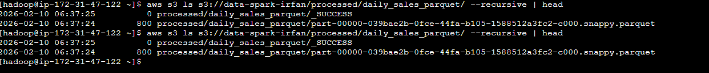
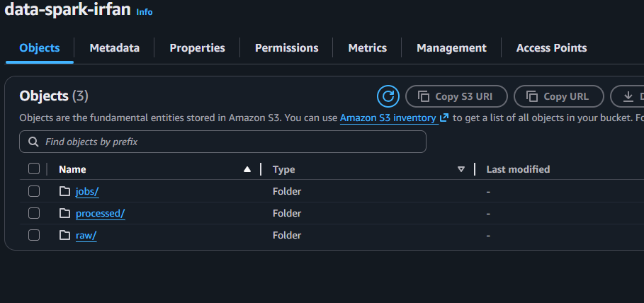

# SPARK ETL PRACTICE — AWS CLI → VS CODE → S3 → EMR

## 1) AWS CLI (Laptop / Windows)
aws --version
aws configure
 isi:
 - AWS Access Key ID
 - AWS Secret Access Key
 - Region: us-east-1
 - Output: parquet

```aws sts get-caller-identity
aws s3 ls s3://data-spark-irfan/
```


## 2) CREATE EMR CLUSTER (AWS CONSOLE)
 AWS Console → EMR → Create cluster
 - Application: Spark
 - EMR on EC2
 - IAM Role EC2: akses S3 + SSM
 Tunggu sampai status cluster = WAITING


## 3) CONNECT KE EMR (SSM, TANPA SSH)
 AWS Console → Systems Manager → Session Manager → Start session
` sudo su - hadoop`
whoami
 hasil: hadoop

`spark-submit --version`


## 4 TULIS KODE SPARK (VS CODE / LAPTOP) 
 File: `etl_daily_sales.py ` 
 (file ini JANGAN dijalankan di laptop)

```
from pyspark.sql import SparkSession, Row
from pyspark.sql.functions import col, sum as _sum


# bikin konstanta lokasi data di S3.
# RAW_PATH = tempat menyimpan data mentah (raw) dalam format CSV.
# PROCESSED_PATH = tempat menyimpan hasil olahan (processed) dalam format Parquet.

BUCKET = "data-spark-irfan"
RAW_PATH = f"s3://{BUCKET}/raw/events_csv/"
PROCESSED_PATH = f"s3://{BUCKET}/processed/daily_sales_parquet/"

spark = SparkSession.builder.appName("daily-sales-etl").getOrCreate()

# builder = konfigurator SparkSession.
# appName("daily-sales-etl") = memberi nama job (akan terlihat di YARN/Spark UI).
# getOrCreate():
# kalau SparkSession sudah ada → pakai yang existing
# kalau belum → buat baru


# 1)  buat data dummy
# user_id = siapa usernya
# event = jenis event (buy atau view)
# amount = nilai transaksi (0 untuk view)
# event_date = tanggal event

data = [
    Row(user_id="u1", event="buy",  amount=100, event_date="2025-01-01"),
    Row(user_id="u2", event="buy",  amount=50,  event_date="2025-01-01"),
    Row(user_id="u1", event="view", amount=0,   event_date="2025-01-01"),
    Row(user_id="u3", event="buy",  amount=200, event_date="2025-01-02"),
    Row(user_id="u2", event="view", amount=0,   event_date="2025-01-02"),
]
df_raw = spark.createDataFrame(data) 
#Mengubah list Python data menjadi DataFrame Spark bernama df_raw.


# 2) Menulis RAW ke S3 sebagai CSV
df_raw.write.mode("overwrite").option("header", True).csv(RAW_PATH)
# A. write  Memulai proses menulis DataFrame ke storage.
# B. mode("overwrite") Kalau folder tujuan sudah ada
# C. .option("header", True) CSV akan punya baris header: user_id,event,amount,event_date.


# 3) Read RAW from S3
df = spark.read.option("header", True).csv(RAW_PATH)


# 4) Transform: filter buy, cast amount, aggregate per day
df_daily = (
    df.filter(col("event") == "buy")
      .selectExpr("event_date", "cast(amount as int) as amount")
      .groupBy("event_date")
      .agg(_sum("amount").alias("total_amount"))
)

df_daily.show()

# ----------------INTI----------------
#A. filter(col("event") == "buy") Ambil hanya baris yang event-nya buy.
# Hasil sementara: hanya transaksi pembelian.

#B. selectExpr("event_date", "cast(amount as int) as amount")
# Pilih hanya kolom yang dibutuhkan.
# cast(amount as int):
# karena CSV biasanya baca amount sebagai string
# kita paksa jadi integer supaya bisa di-sum dengan benar
# selectExpr dipakai karena bisa langsung pakai ekspresi SQL kecil (cast).

# C. groupBy("event_date")
# Mengelompokkan data per tanggal.

# D. agg(_sum("amount").alias("total_amount"))
# Menjumlahkan kolom amount untuk tiap group tanggal.
# Hasil kolom diberi nama total_amount.


# 5) Menulis PROCESSED ke S3 sebagai Parquet
df_daily.write.mode("overwrite").parquet(PROCESSED_PATH)

# Kenapa Parquet?
# Format kolumnar → baca cepat, hemat storage, bagus untuk analytics.
# Standar umum di data lake.

spark.stop()
# Mematikan SparkSession.
# Melepas resource (executor, konteks).
# Praktik baik untuk script batch supaya tidak menggantung.


```
## 5) UPLOAD FILE KE S3 (LAPTOP)
```aws s3 cp etl_daily_sales.py s3://data-spark-irfan/jobs/etl_daily_sales.py
aws s3 ls s3://data-spark-irfan/jobs/
```


## 6) JALANKAN JOB DI EMR
(PASTIKAN BUKAN di pyspark >>>)
`spark-submit s3://data-spark-irfan/jobs/etl_daily_sales.py`


## 7) VERIFIKASI OUTPUT
`aws s3 ls s3://data-spark-irfan/processed/daily_sales_parquet/ --recursive`
 harus ada:
 ```
 - _SUCCESS
 - part-xxxx.snappy.parquet
```



